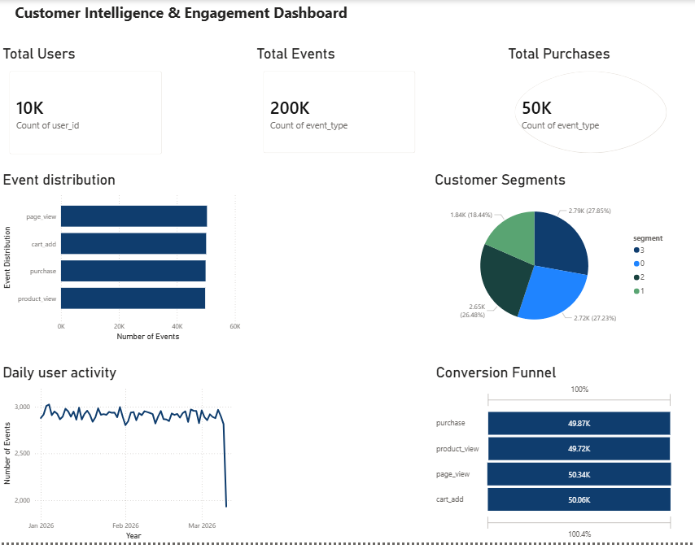

# Customer Insights & Digital Engagement Analytics Platform

## Project Overview
This project builds an **end-to-end analytics platform** to analyze digital user interaction data and generate business insights.

The system simulates clickstream activity, processes data through a **Python ETL pipeline**, performs **customer segmentation using machine learning**, and visualizes key metrics using an **interactive Power BI dashboard**.

---

## Architecture

User Interaction Data
↓
Python Data Generator
↓
AWS S3 Data Lake
↓
AWS Athena SQL Analytics
↓
Customer Segmentation (Machine Learning)
↓
Power BI Dashboard

---

## Technologies Used

- **Python**
- **Pandas**
- **Scikit-learn**
- **AWS S3**
- **AWS Athena**
- **SQL**
- **Power BI**
- **SciPy**

---

## Dataset

The project simulates digital interaction data from a platform.

**Dataset characteristics**

- ~10,000 users
- ~200,000+ interaction events
- Event types:
  - `page_view`
  - `product_view`
  - `cart_add`
  - `purchase`

---

## Key Features

### Data Pipeline
- Python ETL pipeline for processing interaction data
- Data cleaning and feature engineering
- Aggregation of engagement metrics

### Cloud Analytics
- Data stored in **AWS S3 data lake**
- Analytics queries executed using **AWS Athena**

### Customer Segmentation
- Implemented **K-Means clustering**
- Segmented users into behavioral groups

### Marketing Experimentation
- A/B testing simulation for campaign performance analysis

---

## Power BI Dashboard

The dashboard visualizes:

- Total users
- Total interaction events
- Total purchases
- Event distribution
- Customer segmentation
- Daily engagement trends
- Conversion funnel

### Dashboard Preview

---

## Business Insights

Key findings from the analysis:

- **Page views represent ~50% of platform interactions**, indicating high browsing activity.
- The conversion funnel shows a **~60% drop-off between page view and product view**.
- Customer segmentation identifies **high-value users responsible for a large share of purchases**.
- A/B testing shows **Campaign B achieves ~33% higher conversion rates than Campaign A*